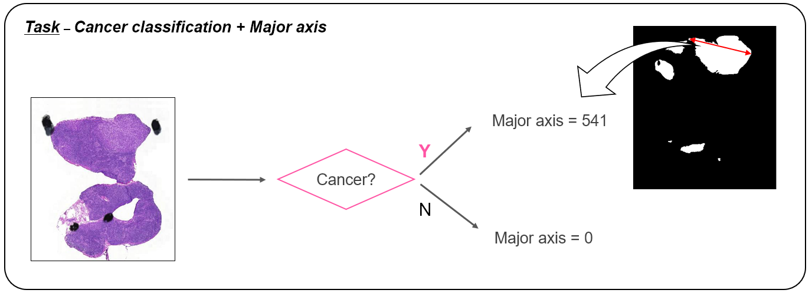
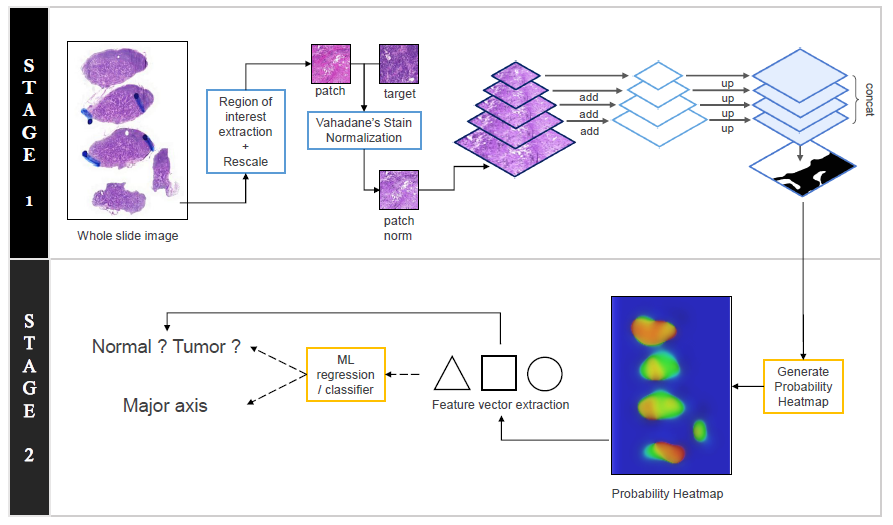

# HeLP Challenge 2019 Breast Cancer 1st place solution

This repository is **1st place solution** to the **Breast Cancer Classification Task of HeLP Challenge 2019**.  



## Model

### Stage 1
- Preprocessing: ROI extraction, Rescale, Vahadane Stain Normalization
- Pixel-wise Segmentation: Feature Pyramid Network(FPN)
### Stage 2
- Feature extraction from probability heatmap
- Prediction final probability and major axis based on features

And also, you can see detailed model description from [this link](./assets/slide.pdf).

## Dependencies
- keras
- segmentation_models
- openslide
- staintools
- numpy
- pandas
- sklearn
- skimage

## Usage
### Train
Run the `train.sh`.  
```bash
$ sh train.sh
```
### Inference
Run the `inference.py`.
```bash
$ python inference.py
```

## Authors
- Daeyoung Kim / [@cyc1am3n](https://github.com/cyc1am3n)  
- Taewoo Kim / [@Taeu](https://github.com/Taeu)  
- Jonghyun Choi / [@ExcelsiorCJH](https://github.com/ExcelsiorCJH)